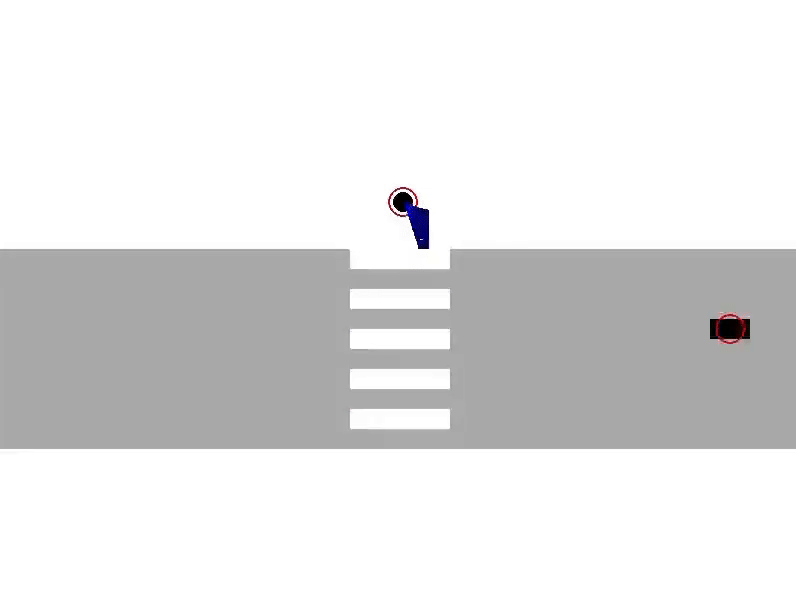

# 🚗 Conformal Tube MPC

A learning-based Model Predictive Control framework for safe planning in interactive multi-agent systems with coupled dynamics and uncertainty.


---

## 🎥 Demo


<p align="center">
  
</p>

---


## 📖 Project Overview

This project implements the framework described in our paper:

**"Learning-Based Conformal Tube MPC for Safe Control in Interactive Multi-Agent Systems"**  
*Shuqi Wang, Yue Gao, Xiang Yin*

The goal is to safely control a system (e.g., autonomous vehicle) in environments with **uncontrollable, state-coupled agents** (e.g., pedestrians). We predict agent actions using neural networks and quantify uncertainty with **conformal prediction**, embedding it into a **dynamic reachable tube MPC** for probabilistic safety.

---

## ✨ Features

- ✅ Predicts agent actions using neural networks
- ✅ Finite-sample uncertainty calibration via conformal prediction
- ✅ Reachable tube propagation under action-level uncertainty
- ✅ Safety-aware MPC with cumulative probability bound ≥ γᵀ
- ✅ Real-time safe control for interactive multi-agent systems

---

## 📁 Project Structure

```
Conformal_Tube_MPC/
Conformal_Tube_MPC/
├── assets/
│   ├── conformal_grid.pkl          # Conformal Grid for function eta(x,y) from simulated trajectories (calibration)
│   └── model.pth                   # Trained neural network model for pedestrian prediction
├── cbf/
│   ├── cp_cbf_controller.py        # CP CBF control method
│   └── vanilla_cbf_controller.py   # CBF-based control method
├── envs/
│   ├── dynamics.py                # Vehicle and pedestrian dynamics and integration
│   └── simulator.py               # Data conllection
├── models/
│   └── predictor.py                # Neural network architecture for pedestrian action prediction
├── mpc/
│   ├── tubempc_controller.py       # Tube-based MPC controller
│   ├── vanillampc_controller.py    # Baseline MPC without reachable tube
│   └── ped_dynamics.py             # Reachable tube propagation using conformal uncertainty
├── results/
│   └── [figs.png]                  # Simulation results
├── simulation/
│   ├── rollout.py                  # Run single episode simulation
│   ├── batch_runner.py             # Batch evaluation for success rate
│   └── config.yaml                 # Scenario parameters and MPC settings

├── main.py                         # Main entry point for running a simulation
├── eval.py                         # Evaluate performance of MPC policy
├── evalcbf.py                      # Evaluate performance of CBF controller
├── mpc_batch_results.log           # Batch results for tube-based MPC
├── mpc_batch_results_vanilla.log  # Batch results for vanilla MPC
├── batch_results_cbf.log          # Batch results for CBF controller
├── LICENSE                         # MIT License
└── README.md                       # Project documentation

```

---

## ⚙️ Installation

```bash
# Install dependencies
pip install -r requirements.txt
```

---

## 🚀 Usage

```bash
# Generate Conformal Grid
python generate_cp_grid.py

# Run a full MPC simulation
python main.py
```

---
## 📌 Parameters (config.yaml)

| Parameter     | Description                           | Example        |
|---------------|---------------------------------------|----------------|
| T             | MPC planning horizon                  | 5              |
| gamma         | Conformal coverage probability        | 0.9            |
| dsafe         | Safe distance threshold               | 1.0 (meters)   |
| vcar_max      | Max car speed                         | 15 (m/s)       |

---

## 📚 Citation

If you find this project useful, please cite:

```
xxxxxxx
```

---

## 📝 License

This project is licensed under the [MIT License](./LICENSE).

---

## 🙌 Acknowledgements

- Based on conformal prediction theory
- Inspired by prior work in CBF, MPC, and interaction modeling
